# Agentic Trading OS - Architecture Diagrams

This document contains comprehensive Mermaid diagrams illustrating the platform's architecture, data flows, integrations, and site structure.

---

## 1. SITE MAP

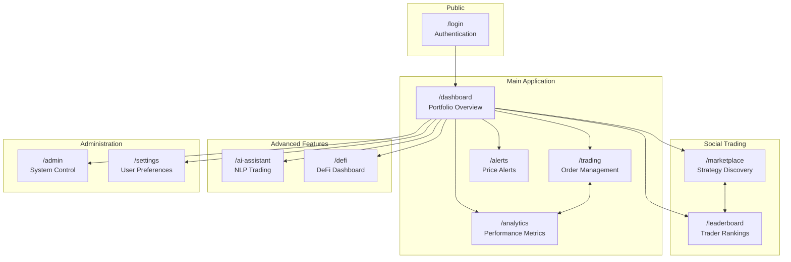

---

## 2. HIGH-LEVEL SYSTEM ARCHITECTURE

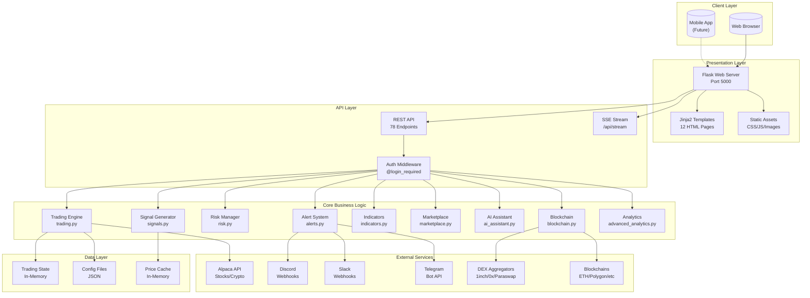

---

## 3. DATA FLOW DIAGRAMS

### 3.1 Order Execution Flow

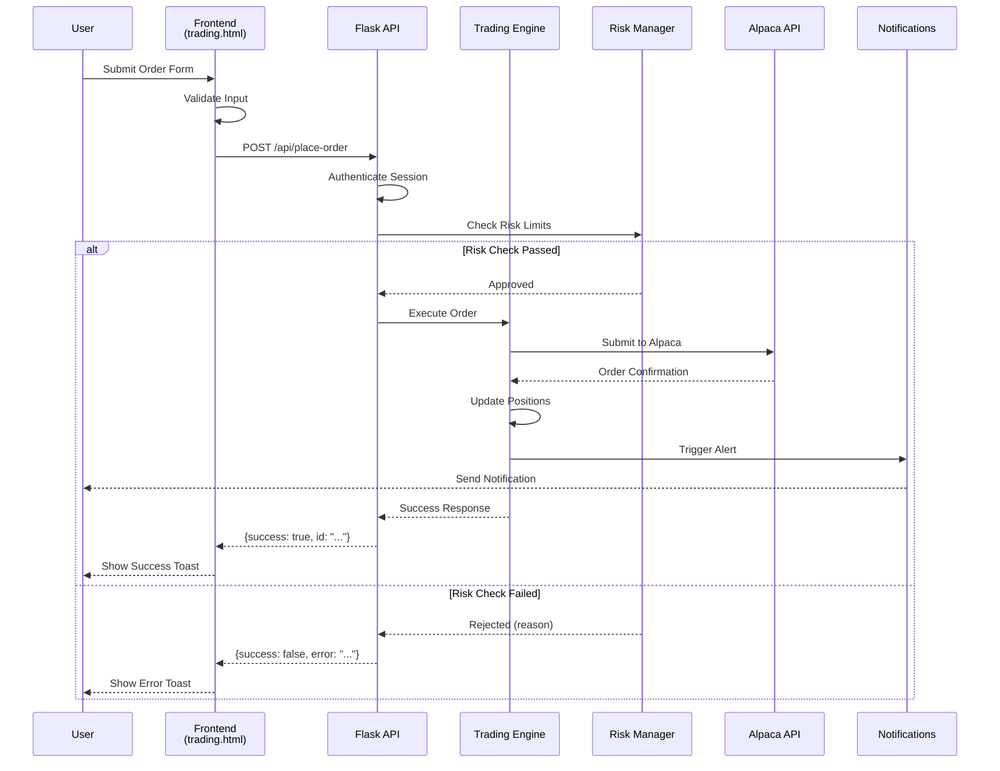

### 3.2 Real-Time Data Stream Flow

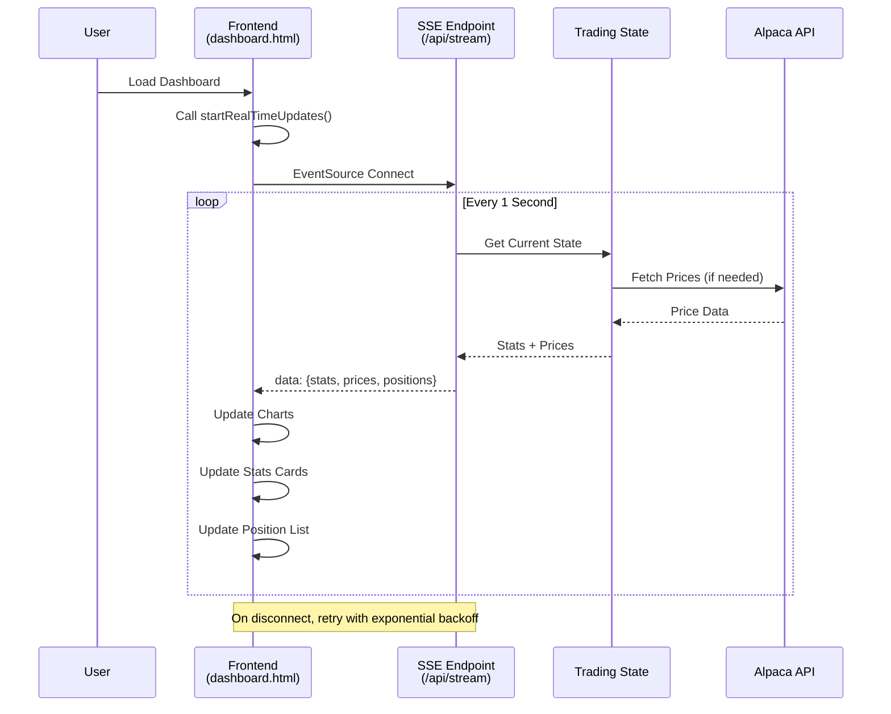

### 3.3 AI Assistant Flow

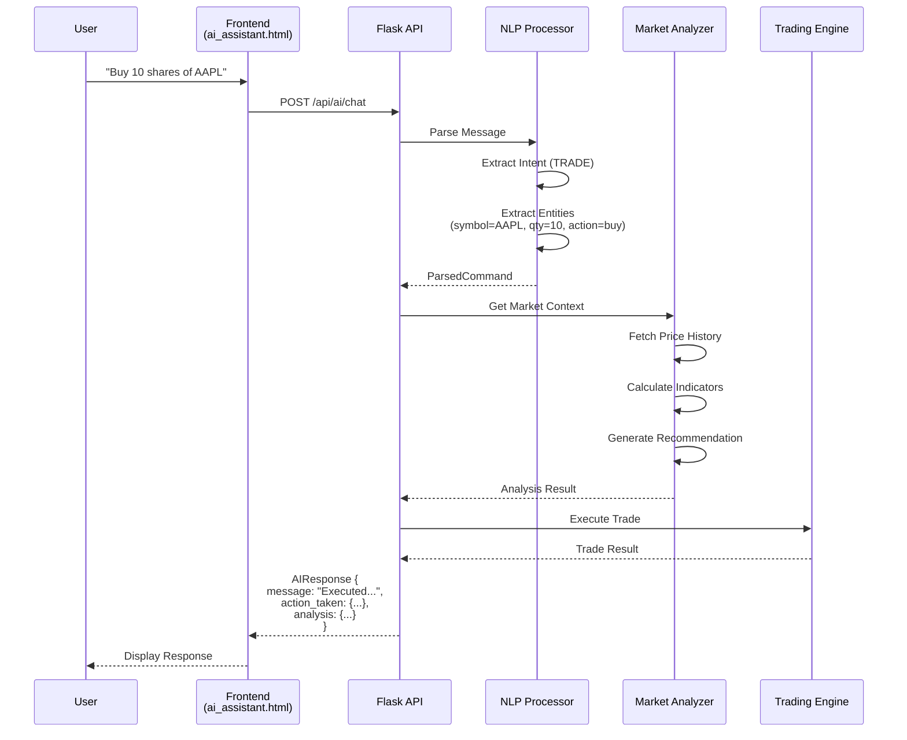

### 3.4 Alert System Flow

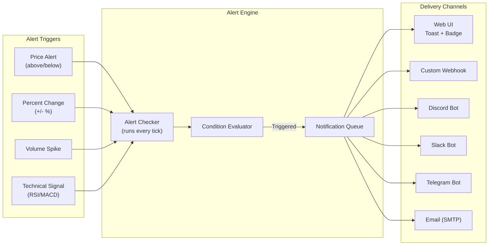

---

## 4. API ENDPOINT MAP

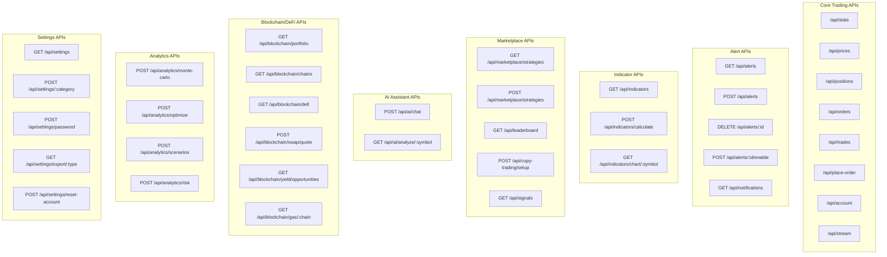

---

## 5. MODULE DEPENDENCY GRAPH

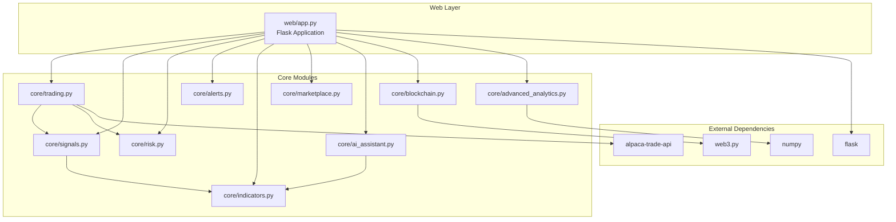

---

## 6. INTEGRATION ARCHITECTURE

```mermaid
flowchart TB
    subgraph Platform["Agentic Trading OS"]
        CORE["Core Platform"]
    end

    subgraph Brokers["Broker Integrations"]
        ALP["Alpaca<br/>US Stocks + Crypto"]
        BIN["Binance<br/>(Planned)"]
        CB["Coinbase<br/>(Planned)"]
        IBKR["Interactive Brokers<br/>(Planned)"]
    end

    subgraph DEXs["DEX Aggregators"]
        INCH["1inch"]
        PARA["Paraswap"]
        ZRX["0x Protocol"]
        KYBER["Kyber Network"]
    end

    subgraph Chains["Blockchain Networks"]
        ETH["Ethereum"]
        POLY["Polygon"]
        ARB["Arbitrum"]
        OPT["Optimism"]
        BASE["Base"]
        AVAX["Avalanche"]
        BSC["BNB Chain"]
        SOL["Solana"]
    end

    subgraph Notifications["Notification Services"]
        DISC["Discord"]
        SLCK["Slack"]
        TELE["Telegram"]
        SMTP["Email (SMTP)"]
        HOOK["Custom Webhooks"]
    end

    subgraph Data["Market Data"]
        ALPDATA["Alpaca Data"]
        CGECKO["CoinGecko<br/>(Planned)"]
        CMARKETCAP["CoinMarketCap<br/>(Planned)"]
    end

    CORE <-->|REST API| ALP
    CORE -.->|Future| BIN
    CORE -.->|Future| CB
    CORE -.->|Future| IBKR

    CORE <-->|HTTP| INCH
    CORE <-->|HTTP| PARA
    CORE <-->|HTTP| ZRX
    CORE <-->|HTTP| KYBER

    CORE <-->|RPC/WebSocket| ETH
    CORE <-->|RPC| POLY
    CORE <-->|RPC| ARB
    CORE <-->|RPC| OPT
    CORE <-->|RPC| BASE
    CORE <-->|RPC| AVAX
    CORE <-->|RPC| BSC
    CORE <-->|RPC| SOL

    CORE -->|Webhook| DISC
    CORE -->|Webhook| SLCK
    CORE -->|Bot API| TELE
    CORE -->|SMTP| SMTP
    CORE -->|HTTP POST| HOOK

    CORE <-->|WebSocket| ALPDATA
    CORE -.->|Future| CGECKO
    CORE -.->|Future| CMARKETCAP
```

---

## 7. USER JOURNEY FLOWS

### 7.1 New User Onboarding

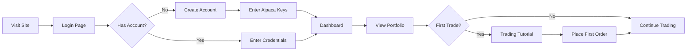

### 7.2 Copy Trading Journey

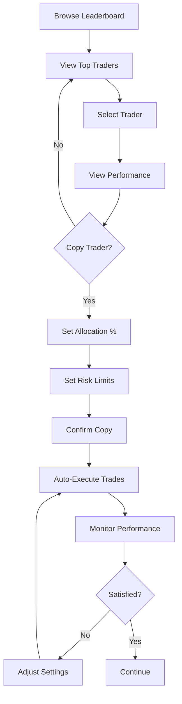

### 7.3 AI Assistant Interaction

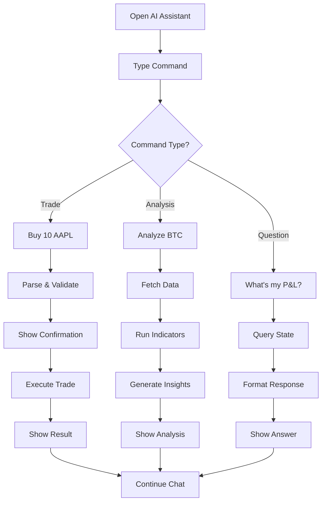

---

## 8. DEPLOYMENT ARCHITECTURE

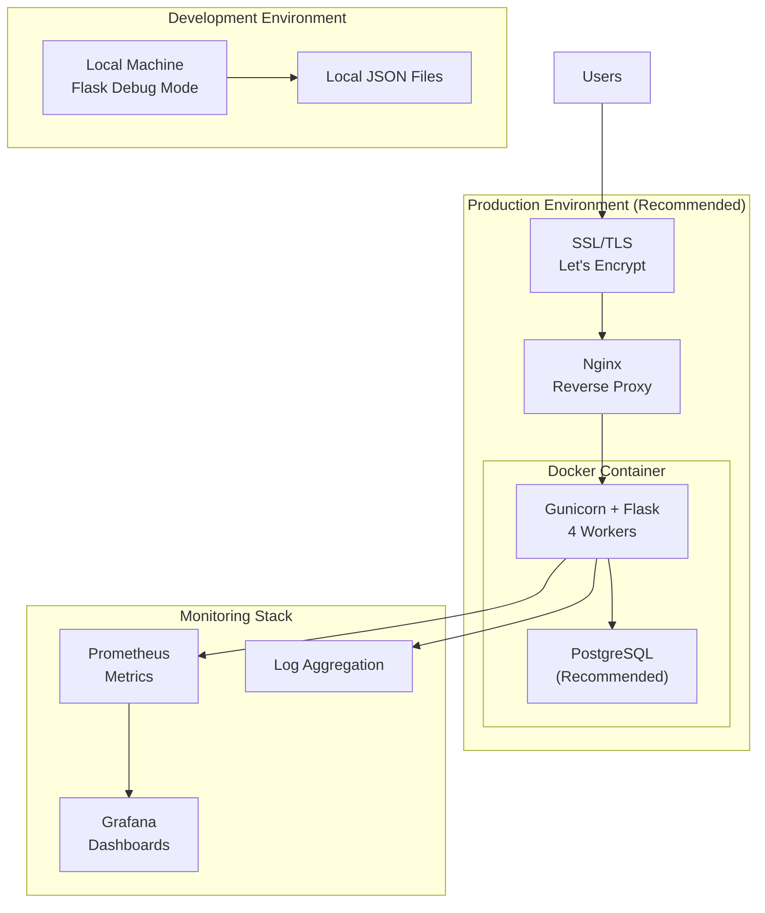

---

## 9. SECURITY ARCHITECTURE

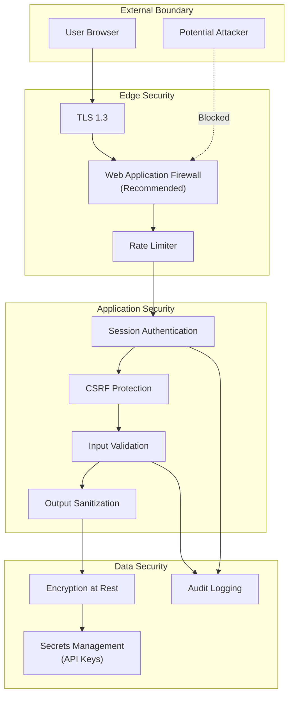

---

## 10. STATE MANAGEMENT

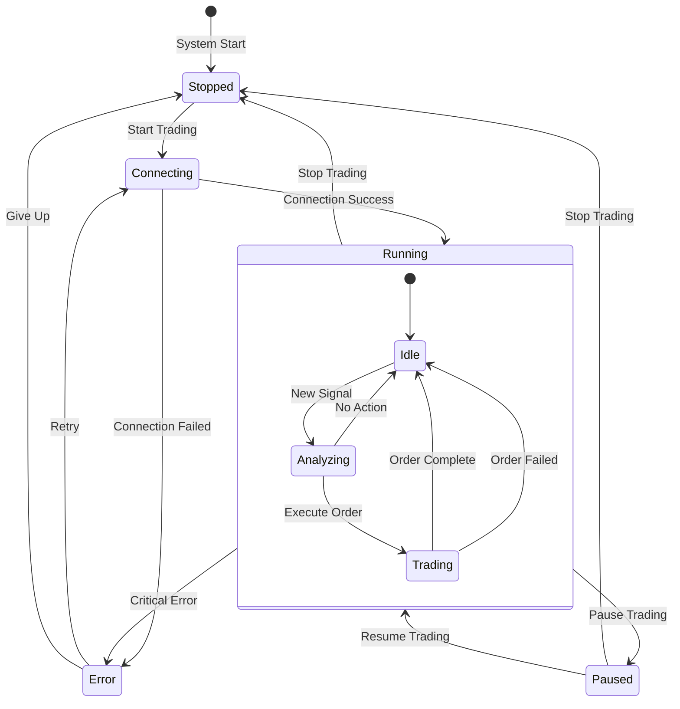

---

## Diagram Legend

| Symbol | Meaning |
|--------|---------|
| Solid Arrow (→) | Active Integration |
| Dashed Arrow (-.→) | Planned/Future |
| Rectangle | Component/Module |
| Cylinder | Database/Storage |
| Diamond | Decision Point |
| Rounded Rectangle | External Service |

---

*Generated for Agentic Trading OS v2.0*
*Last Updated: January 2026*
